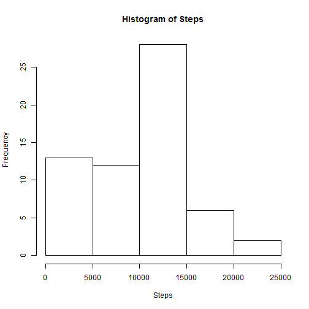
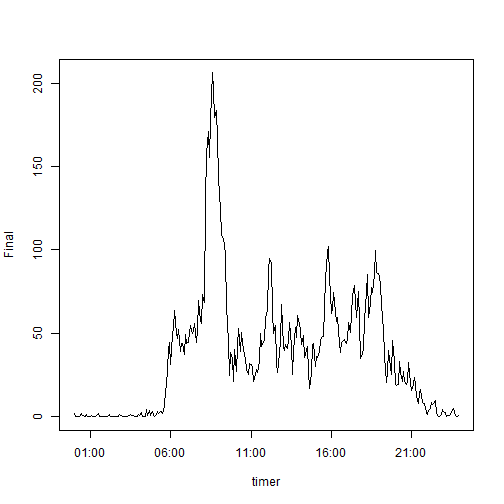
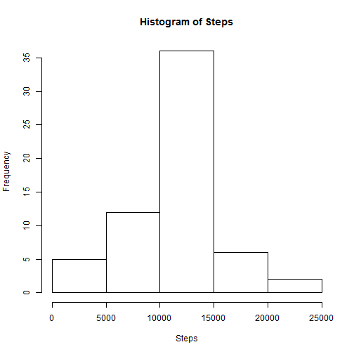
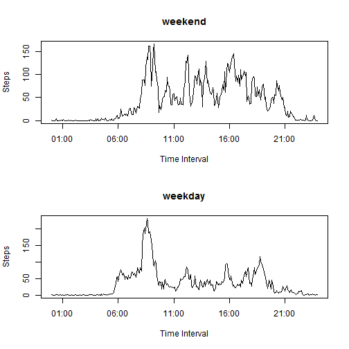

# Project 1 - Activity Monitoring Data
Stanley Lam

## Initialize

Allows R code to be displayed.


```r
opts_chunk$set(echo = TRUE)
```


## Loading and preprocessing the data
Read raw data into working memory


```r

Data <- read.csv("activity.csv")
```

```
## Warning: cannot open file 'activity.csv': No such file or directory
```

```
## Error: cannot open the connection
```


## Mean steps per day
Creates histogram, mean and median of total steps per day


```r
Steps <- tapply(Data$steps, Data$date, function(x) {
    sum(x, na.rm = TRUE)
})

hist(Steps)
```

 

```r
mean(Steps)
```

```
## [1] 9354
```

```r
median(Steps)
```

```
## [1] 10395
```


The mean number of steps per day is 9354.23 steps.
The median number of steps per day is 10395 steps.

## Average daily pattern
Creates a time series plot of steps taken per 5-minute interval across all days


```r
tm1 <- as.POSIXct("00:00", format = "%H:%M")
tm2 <- as.POSIXct("23:55", format = "%H:%M")
timer <- seq(from = tm1, to = tm2, by = "5 mins")

t = 0
Final = numeric(length = 0)
for (i in timer) {
    t <- t + 1
    Final[t] <- mean(Data$steps[Data$interval == Data$interval[t]], na.rm = TRUE)
}

plot(timer, Final, type = "l")
```

 


The 5-minute interval that contains the maximum number of steps (on average) is 8:35am - 8:40pm.

## Input missing values

Calculates the total number of missing values in the dataset and creates a new dataset with the missing values filled in.  Creates a histogram and calculates mean/median on the new dataset.

### The strategy for filling in missing values used is: for any missing value, impute the mean for that 5-minute interval across all days from the original dataset.


```r
New <- Data
for (i in 1:nrow(New)) {
    if (is.na(New$steps[i])) {
        New$steps[i] <- mean(Data$steps[Data$interval == Data$interval[i]], 
            na.rm = TRUE)
    }
}
summary(New$steps)
```

```
##    Min. 1st Qu.  Median    Mean 3rd Qu.    Max. 
##     0.0     0.0     0.0    37.4    27.0   806.0
```

```r

Steps <- tapply(New$steps, New$date, function(x) {
    sum(x, na.rm = TRUE)
})

par(mfrow = c(1, 1))

hist(Steps)
```

 

```r
mean(Steps)
```

```
## [1] 10766
```

```r
median(Steps)
```

```
## [1] 10766
```


The mean number of steps per day is now 10766.19 steps.
The median number of steps per day is 10766.19 steps.

The impact of imputing missing data increases the estimates of the total daily number of steps.

## Weekday / Weekend Comparison

Creates a panel plot comparing weekday activity to weekend activity.


```r

New$dayofweek <- weekdays(as.Date(New$date))

test <- weekdays(as.Date(New$date[1]))

for (i in 1:nrow(New)) {
    if (New$dayofweek[i] %in% c("Saturday", "Sunday")) {
        New$dayofweek[i] <- "weekend"
    } else if (New$dayofweek[i] %in% c("Monday", "Tuesday", "Wednesday", "Thursday", 
        "Friday")) {
        New$dayofweek[i] <- "weekday"
    }
}
New$dayofweek <- as.factor(New$dayofweek)

tm1 <- as.POSIXct("00:00", format = "%H:%M")
tm2 <- as.POSIXct("23:55", format = "%H:%M")
timer <- seq(from = tm1, to = tm2, by = "5 mins")

t = 0
Final = numeric(length = 0)
par(mfrow = c(2, 1))
for (i in timer) {
    t <- t + 1
    Subset <- New[New$dayofweek == "weekend", ]
    Final[t] <- mean(Subset$steps[Subset$interval == Subset$interval[t]], na.rm = TRUE)
}
plot(timer, Final, type = "l", main = "weekend", xlab = "Time Interval", ylab = "Steps")
t = 0
Final = numeric(length = 0)
for (i in timer) {
    t <- t + 1
    Subset <- New[New$dayofweek == "weekday", ]
    Final[t] <- mean(Subset$steps[Subset$interval == Subset$interval[t]], na.rm = TRUE)
}
plot(timer, Final, type = "l", main = "weekday", xlab = "Time Interval", ylab = "Steps")
```

 

